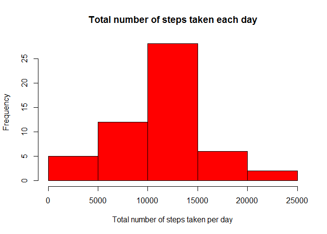
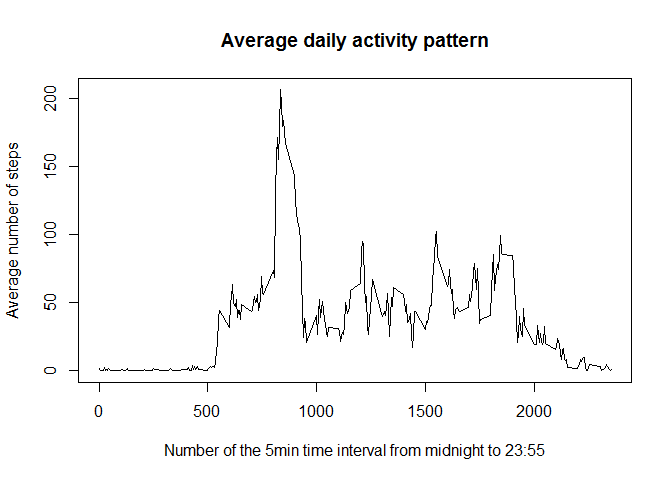
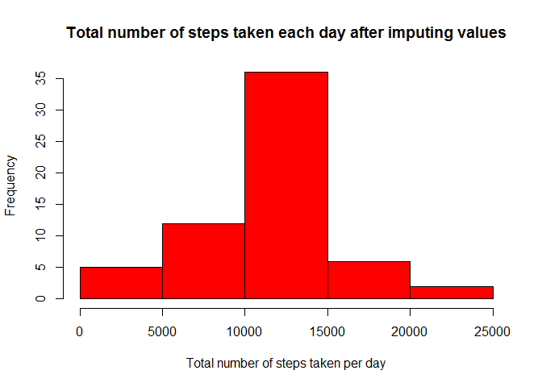
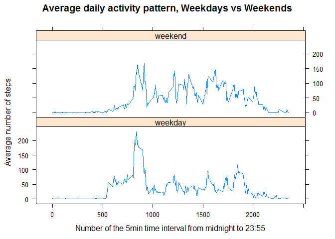

# Reproducible Research: Peer Assessment 1


## Loading and preprocessing the data

1. Load the data (i.e. read.csv())

```r
## extracting file from zip archive
unzip("activity.zip")

##loading the activity file
activity <- read.csv("activity.csv")
```

2. Process/transform the data (if necessary) into a format suitable for your analysis

```r
##converting date column to date class
activity$date<- as.Date(activity$date)
```


## What is mean total number of steps taken per day?
For this part of the assignment, we will ignore the missing values in the dataset.

1.Calculate the total number of steps taken per day

```r
stepsPerDay <- aggregate(steps ~ date, data=activity, FUN="sum", na.rm=TRUE)
head(stepsPerDay)
```

```
##         date steps
## 1 2012-10-02   126
## 2 2012-10-03 11352
## 3 2012-10-04 12116
## 4 2012-10-05 13294
## 5 2012-10-06 15420
## 6 2012-10-07 11015
```
2.Make a histogram of the total number of steps taken each day

```r
hist(stepsPerDay$steps, col = "red", main = "Total number of steps taken each day", xlab = "Total number of steps taken per day" )
```

 

3. Calculate and report the mean and median of the total number of steps taken per day

Calculating the mean

```r
meanstepsPerDay <- mean(stepsPerDay$steps, na.rm = TRUE)
meanstepsPerDay
```

```
## [1] 10766.19
```
Calculating the median

```r
medianstepsPerDay <- median(stepsPerDay$steps, na.rm = TRUE)
medianstepsPerDay
```

```
## [1] 10765
```

## What is the average daily activity pattern?
1. Make a time series plot (i.e. type = "l") of the 5-minute interval (x-axis) and the average number of steps taken, averaged across all days (y-axis)

I will aggregate all identical 5 minutes intervals across all days and calculate the average by interval.

```r
averageByInterval <- aggregate(steps ~ interval, data=activity, FUN="mean", na.rm=TRUE)
plot(averageByInterval$interval,averageByInterval$steps, main="Average daily activity pattern", ylab="Average number of steps",xlab="Number of the 5min time interval from midnight to 23:55", type = "l")
```

 

2. Which 5-minute interval, on average across all the days in the dataset, contains the maximum number of steps?

```r
maxSteps5minInterval <- averageByInterval$interval[which.max(averageByInterval$steps)]
maxSteps5minInterval
```

```
## [1] 835
```
The 5 min interval 835 contains, on average accross all the days in the dataset the maximun number of steps.

## Imputing missing values
In this dataset, there are a number of days/intervals where there are missing values (coded as NA). The presence of missing days may introduce bias into some calculations or summaries of the data.

1. Calculate and report the total number of missing values in the dataset (i.e. the total number of rows with NAs)
We will calculate the number of NAs per column


```r
missingStepCount <- sum(is.na(activity$steps))
missingStepCount
```

```
## [1] 2304
```

```r
missingDates <- sum(is.na(activity$date))
missingDates
```

```
## [1] 0
```

```r
missingIntervals <- sum(is.na(activity$interval))
missingIntervals
```

```
## [1] 0
```

2. Devise a strategy for filling in all of the missing values in the dataset. The strategy does not need to be sophisticated. For example, you could use the meanmedian for that day, or the mean for that 5-minute interval, etc.

To fill in the missing step values, I will use the mean for that 5 min interval across all days.

3. Create a new dataset that is equal to the original dataset but with the missing data filled in.


```r
#Merge of the original dataset with the calculated average per 5 min interval
completeActivity <- merge(activity, averageByInterval, by = "interval" )

#round down number of steps
completeActivity$steps.y <- floor(completeActivity$steps.y)

#create dataframe with only the new number of steps when the original number was NA
onlyNAs <- subset(completeActivity, is.na(completeActivity$steps.x))

#clean onlyNAs dataframe by removing column with NAs and re-oredring the columns to have column order identical to original dataset
onlyNAs <- onlyNAs[,c(1,4,3)]

#rename headers 
colnames(onlyNAs) <- c("interval","steps","date")

#subset the completeActivity dataframe to only retain records with no NA step values
noNAs <- subset(completeActivity, !is.na(completeActivity$steps.x))
noNAs <- noNAs[,c(1,2,3)]
colnames(noNAs) <- c("interval","steps", "date")

#we can now merge our 2 partial dataframes
completeActivity <- rbind(noNAs,onlyNAs)
sum(is.na(completeActivity$steps))
```

```
## [1] 0
```
We have filled in any missing number of steps in the resulting completeActivity dataset.

4. Make a histogram of the total number of steps taken each day and Calculate and report the mean and median total number of steps taken per day. Do these values differ from the estimates from the first part of the assignment? What is the impact of imputing missing data on the estimates of the total daily number of steps?


```r
#Calculating the new total number of steps taken per day
newStepsPerDay <- aggregate(steps ~ date, data=completeActivity, FUN="sum", na.rm=TRUE)

#creating the requested histogram
hist(newStepsPerDay$steps, col = "red", main = "Total number of steps taken each day after imputing values", xlab = "Total number of steps taken per day" )
```

 

Mean total number of steps taken per day :

```r
newmeanstepsPerDay <- mean(newStepsPerDay$steps, na.rm = TRUE)
newmeanstepsPerDay
```

```
## [1] 10749.77
```

median total number of steps taken per day :

```r
newmedianstepsPerDay <- median(newStepsPerDay$steps, na.rm = TRUE)
newmedianstepsPerDay
```

```
## [1] 10641
```

These new values differ from our first estimates but I would say it's still a reasonable difference, nothing crazy. This would validate our strategy for filling in missing values of steps.

Let's try to quantify the impact of imuputing missing data : for the average total number of steps, we see a decrease of roughly (in pourcentage)


```r
((newmeanstepsPerDay - meanstepsPerDay )/meanstepsPerDay)*100
```

```
## [1] -0.1524977
```

for the median total number of steps, we see a decrease of roughly (in pourcentage) :


```r
((newmedianstepsPerDay - medianstepsPerDay)/medianstepsPerDay)*100
```

```
## [1] -1.151881
```


## Are there differences in activity patterns between weekdays and weekends?

We will Use the dataset with the filled-in missing values for this part (completeActivity)

1. Create a new factor variable in the dataset with two levels - "weekday" and "weekend" indicating whether a given date is a weekday or weekend day.


```r
#adding a dateType column to our dataset, initialized to weekday for every record.
completeActivity$dateType <- "weekday"

#replacing the value weekday by weekend for saturday and sundays
completeActivity$dateType[weekdays(completeActivity$date, abbreviate = TRUE) %in% c("Sat","Sun")] <- "weekend"
```

2. Make a panel plot containing a time series plot of the 5-minute interval (x-axis) and the average number of steps taken, averaged across all weekday days or weekend days (y-axis).


```r
#creating a new dataset with the average number of steps per 5 min intervall and day type (week end or week day)
averageByIntervalAndDaytype <- aggregate(steps ~ interval + dateType, data=completeActivity, FUN="mean", na.rm=TRUE)

#generating the requested plot using lattice
require(lattice)
```

```
## Loading required package: lattice
```

```
## Warning: package 'lattice' was built under R version 3.2.2
```

```r
xyplot(steps ~ interval | dateType, averageByIntervalAndDaytype, layout = c(1,2), type="l", main="Average daily activity pattern, Weekdays vs Weekends", ylab="Average number of steps", xlab="Number of the 5min time interval from midnight to 23:55")
```

 

We can see differences in activity patterns between weekdays and weekends. On weekdays, the subject tends to walk more in the morning whereas is activity seems more constant on weekends.


